# YT-DLP Minimalist

<p align="center">
  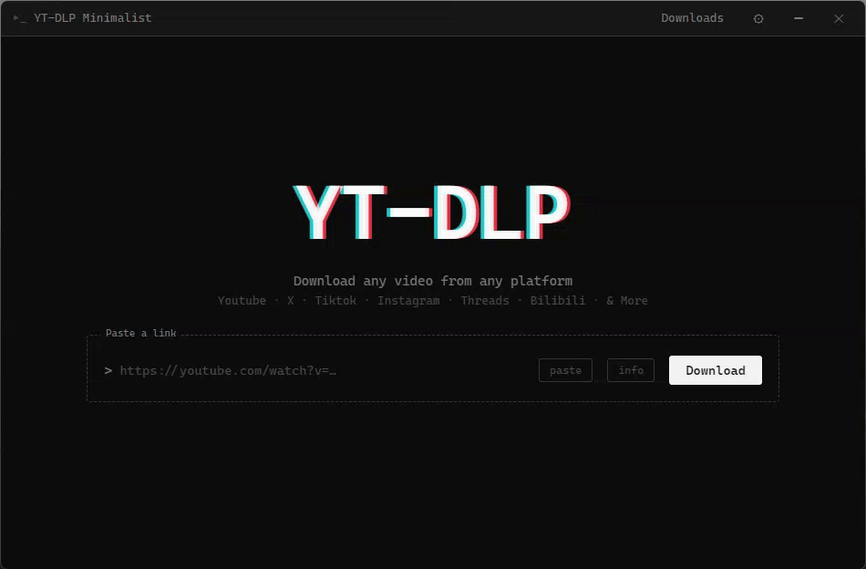
</p>

<p align="center">
  
  
  
  
  <a href="https://www.virustotal.com/gui/file/7c7fc13230e9f467810dba4b27239d1f248e36d2f8888a00b710703aaefac938?nocache=1">
    
  </a>
</p>

<p align="center">
  A minimalist, terminal-styled desktop interface for <a href="https://github.com/yt-dlp/yt-dlp"><code>yt-dlp</code></a>, built with Electron.
  Download videos, audio, and entire playlists from YouTube and hundreds of other sites — no command line required.
</p>

<p align="center">
  <a href="#downloads"><b>Download</b></a> ·
  <a href="#features"><b>Features</b></a> ·
  <a href="#screenshots">Screenshots</a> ·
  <a href="#browser-extension">Browser Extension</a> ·
  <a href="#building-from-source">Build from source</a> ·
  <a href="#faq">FAQ</a>
</p>

---

## Features

- 🎬 **Video, audio, or full playlists** — pick the format and quality you want, per download or by preset.
- 🖥️ **Terminal-style UI** — a clean, minimalist interface with a live terminal mode for the curious.
- 🗂️ **Sidebar navigation** — a collapsible sidebar (new in 1.2.0) gives quick access to a new task, Terminal, Tasks (downloads/history), and Settings, each as its own full page instead of a floating popup.
- 🧩 **Companion browser extension** — send the current tab straight to the app, no copy-pasting URLs.
- 🍪 **Cookie support** — download age-restricted or private content you have access to, with an inline hint next to the URL field telling you when cookies are needed.
- ⚙️ **Presets** — save your favorite format/quality combinations for one-click downloads.
- 🚀 **Concurrent connections per download** — new **Concurrent connections** setting (`-N` / `--concurrent-fragments`, 1–16) speeds up fragmented (HLS/DASH) downloads.
- 🗂️ **Organize by site** — optionally save each download into a per-site subfolder (e.g. `Downloads/Youtube`, `Downloads/TikTok`) so your download folder stays tidy.
- ⏱️ **Smarter shared rate limit** — "Total" rate-limit mode now splits the bandwidth cap across whatever downloads are actually running at the same time, not just the configured playlist concurrency.
- 📂 **Open file or open folder** — history entries now have separate actions to open the downloaded file directly or reveal it in its folder.
- 🔄 **Automatic binary updates** — `yt-dlp`, `ffmpeg`, and Deno stay up to date on their own.
- 📦 **Portable or installer** — use it however you prefer, no forced installation.
- 🔒 **100% local** — everything runs on your machine; nothing is uploaded anywhere.

## Downloads

| File | Description |
|---|---|
| **YT-DLP Minimalist Setup 1.2.0.exe** | Installer — recommended for most users |
| **YT-DLP Minimalist 1.2.0 Portable.exe** | Portable version — no installation required |
| **[YT-DLP_Minimalist_Extension.zip](https://pixeldrain.com/u/A5skyrPp)** | Companion browser extension (Chrome/Edge/Chromium) — see [Browser Extension](#browser-extension) |

### Requirements

Windows 10/11 (64-bit)

## Security

Both files were scanned on VirusTotal and came back clean:

- Installer: 0/65 detections — [View results](https://www.virustotal.com/gui/file/634041b000c68517eeeb057cbda0fc49822581a2ea08442b14b7e988fbc4257a?nocache=1)
- Portable: 0/63 detections — [View results](https://www.virustotal.com/gui/file/cf3b26a8bc6620b1ab5043e975f5db9955a188dc4a2db5a16bc13c9f3e02a346?nocache=1)
- Extencion: 0/64 detections — [View results](https://www.virustotal.com/gui/file/5b6423342c7fd94f5dccdd311b4c212538e30d6de6d9ec8f8ff041eb27385151?nocache=1)

## Screenshots

**Format & Quality Selection (live demo)**

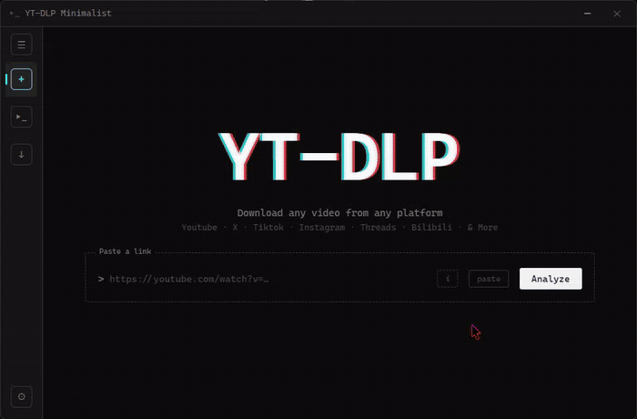

**Video Information and Quality Selection**

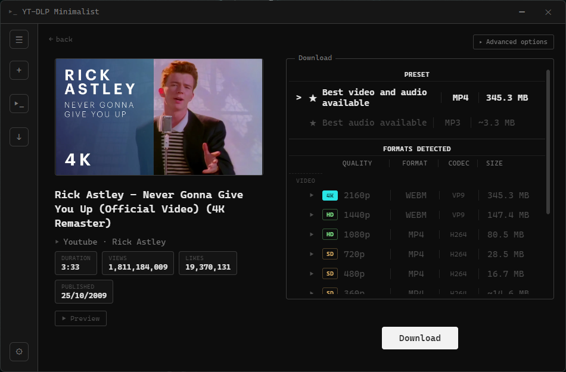

**Downloading Complete Playlists**

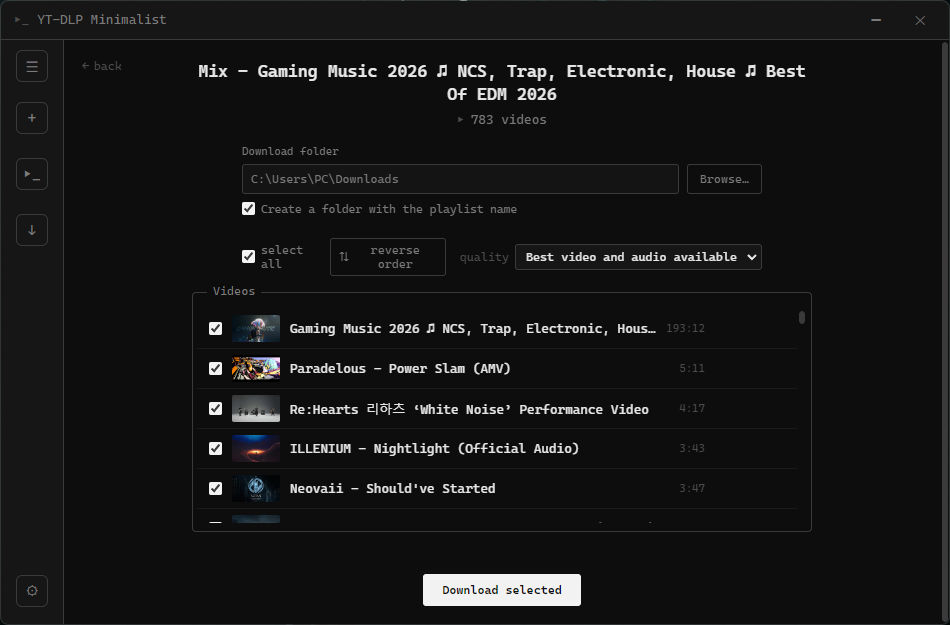

**Terminal mode**

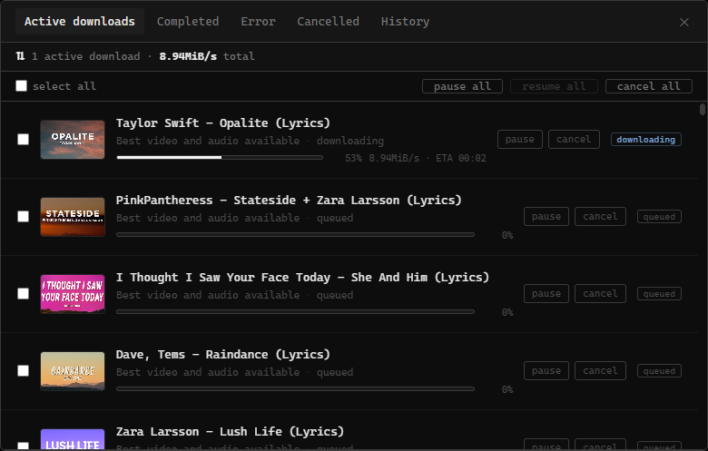

**Active Downloads**

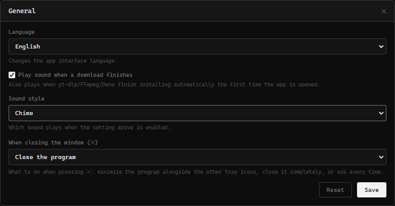

**General Settings**

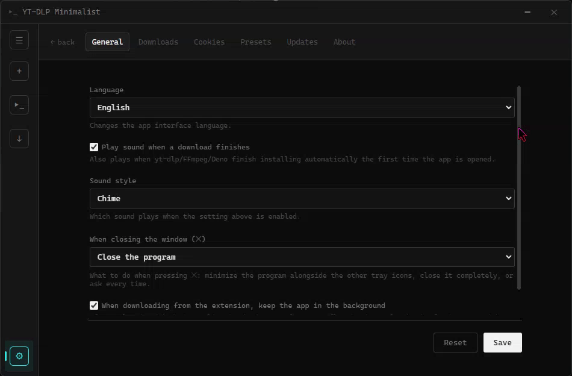

**Download Settings**

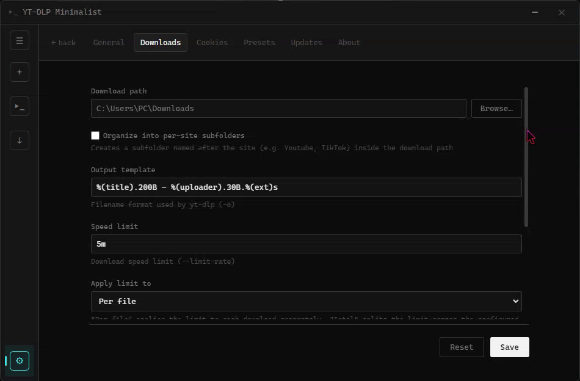

**Cookies**

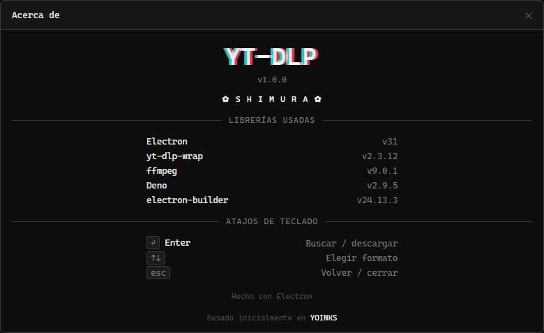

**Presets**

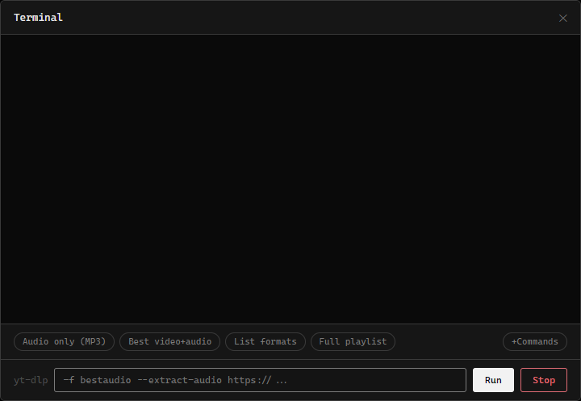

**Updates Panel**

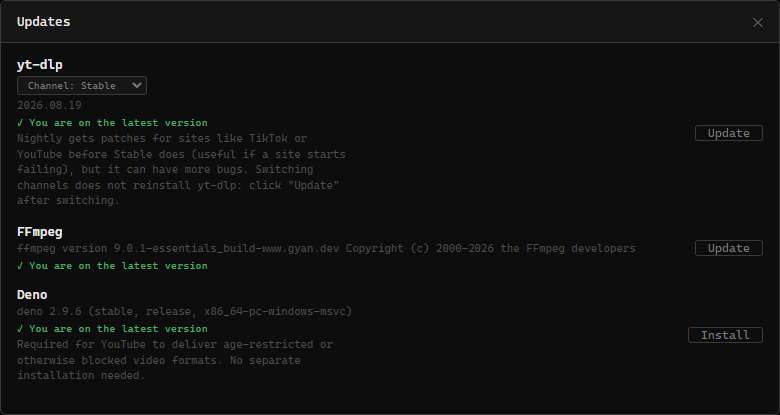

**About**

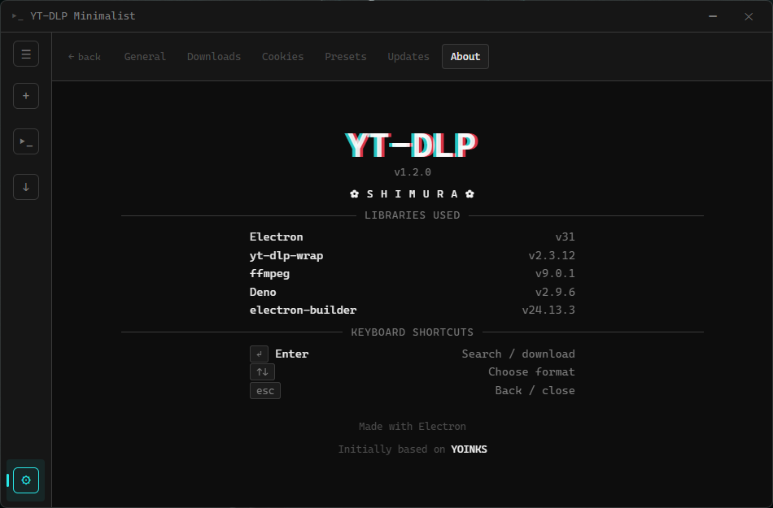

## Browser Extension

<p align="center">
  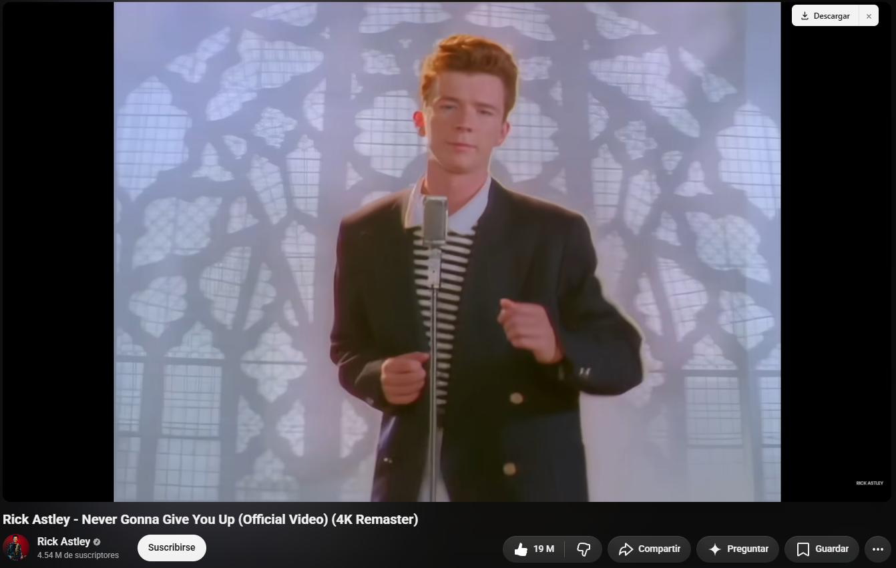
  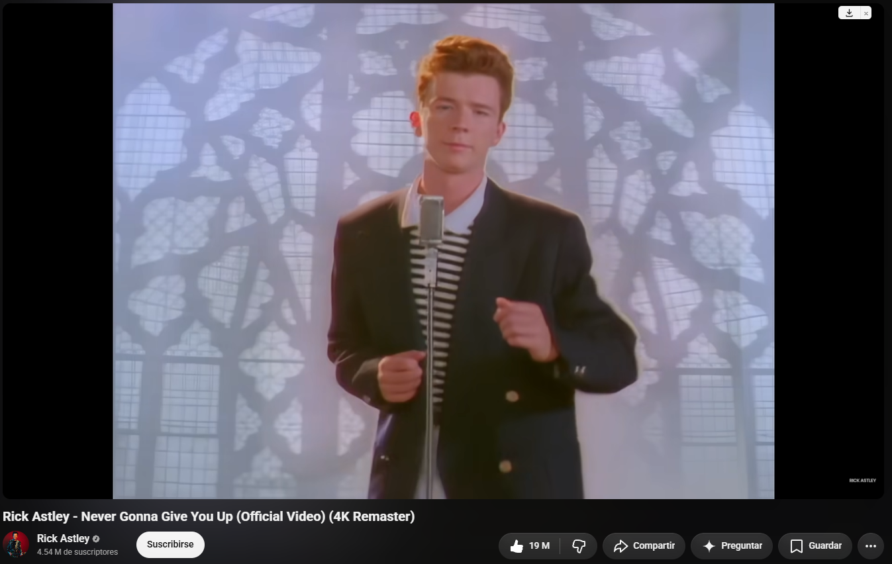
</p>
<p align="center">
  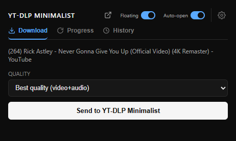
</p>

A companion browser extension (Chrome, Edge, and other Chromium-based browsers) lives in the
[`extension/`](./extension) folder. It sends the current tab's URL straight to YT-DLP Minimalist
so you can queue a download without copying and pasting the link — the app must be running to
receive it, and everything stays local (`127.0.0.1`, nothing leaves your computer).

**[⬇️ Download the extension (.zip)](https://pixeldrain.com/u/A5skyrPp)**

See [`extension/README.md`](./extension/README.md) for installation steps.

## Building from source

### Requirements

- [Node.js](https://nodejs.org) 18 or newer

### Run in development

```bash
npm install
npm start
```

### Build the .exe

```bash
npm run dist
```

This uses `electron-builder` and generates an installer `.exe` (NSIS) and a portable version
inside `dist/`.

### Bundle yt-dlp, ffmpeg, and Deno into the .exe (recommended)

The three binaries are packaged the same way, from the same folder:

1. Download `yt-dlp.exe` from the [yt-dlp releases page](https://github.com/yt-dlp/yt-dlp/releases)
2. Download `ffmpeg.exe` from [gyan.dev builds](https://www.gyan.dev/ffmpeg/builds/) — the
   "release essentials" build; the `.zip` includes several `.exe` files in `bin/`, you only
   need `ffmpeg.exe`
3. Download `deno.exe` from the [Deno releases page](https://github.com/denoland/deno/releases)
   (`deno-x86_64-pc-windows-msvc.zip`)
4. Place all three in `assets/bin/` (`yt-dlp.exe`, `ffmpeg.exe`, `deno.exe`)

`package.json` already points `extraResources` at that folder:

```json
"extraResources": [
  { "from": "assets/bin", "to": "bin" }
]
```

If a binary is missing from `assets/bin`, the app won't crash — it downloads it automatically
to its config folder (`userData/bin`) the first time it's needed, just like before. Bundling
them simply skips that first download and lets the app work offline from the very first
launch, in exchange for a larger installer. You can also force a re-download or update of any
of the three from **Settings → Updates**.

## Project structure

```
yt-dlp-interface/
├── package.json
├── src/
│   ├── main.js
│   ├── preload.js
│   ├── index.html
│   ├── styles.css
│   └── renderer.js
├── extension/
│   ├── manifest.json
│   ├── background.js
│   ├── popup.html / popup.js
│   ├── content-overlay.js / content-overlay.css
│   ├── options.html / options.js
│   └── url-utils.js
└── assets/
```

## FAQ

**Is this safe to use?**
Yes — both the installer and the portable build are scanned on every release and come back
clean on VirusTotal (see [Security](#security)). The app runs entirely on your machine; it
doesn't send any data anywhere.

**Does it work on Mac or Linux?**
Not yet — the current build targets Windows 10/11 only.

**Can the browser extension work in Firefox?**
It's built and tested for Chromium-based browsers (Chrome, Edge, Brave, Opera, Vivaldi). It may
work in Firefox with minor changes, but this isn't officially supported yet.

**Why does downloading fail for some links?**
`yt-dlp` support depends on the site. Update the bundled binaries from **Settings → Updates** —
most failures are fixed by grabbing the latest `yt-dlp` build.

**Can I keep my downloads organized by site automatically?**
Yes — enable **Organize into per-site subfolders** in **Settings → Downloads** and each file
will be saved under a subfolder named after its site (e.g. `Downloads/Youtube`,
`Downloads/TikTok`) inside your chosen download path.

**How do I speed up a slow or fragmented download?**
Raise **Concurrent connections** in **Settings → Downloads** (1–16). It maps to yt-dlp's `-N` /
`--concurrent-fragments` flag and mainly helps HLS/DASH downloads. Higher values can speed
things up, but setting it too high may cause temporary throttling from the source site.

## Contributing

Issues and pull requests are welcome! If you run into a bug or have an idea for a feature,
please [open an issue](../../issues).

## License and Credits

Based on the design of [yoinks](https://github.com/pablostanley/yoinks) by Pablo Stanley,
published under the MIT license.

**Fair Use Note:** Downloading content may violate the terms of service of some platforms —
download only what you have the right to save.

---

<p align="center">
  <sub>Questions or feedback? <a href="https://t.me/xSHIMURAx">t.me/xSHIMURAx</a></sub>
</p>
