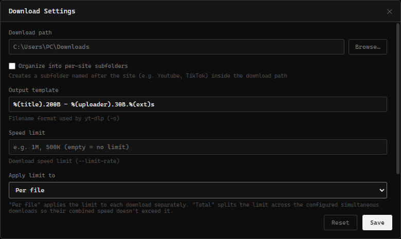
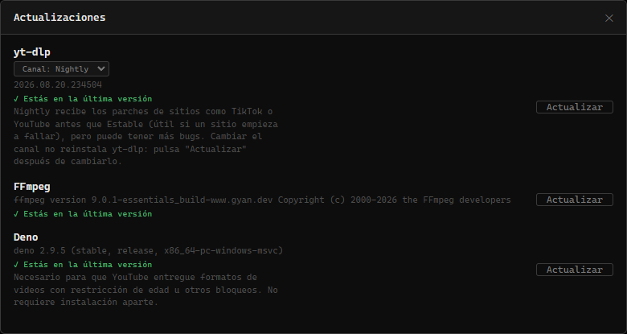

# YT-DLP Minimalist


## A minimalist desktop interface for yt-dlp, built with Electron, that downloads videos, audio, and entire playlists from YouTube, and supports multiple platforms.

## Downloads

YT-DLP Minimalist Setup 1.0.0.exe — installer (recommended for most users)

YT-DLP Minimalist 1.0.0 Portable.exe — Portable version; no installation required.

## Requirements
Windows 10/11 (64 bits)

## Security

Both files were scanned on VirusTotal and came back clean:

- Installer: 0/66 detections — [View results](https://www.virustotal.com/gui/file/bd799cc2d090b38a955ff0e8a0b269ef951788cd07d150d840e80bc394e6242f)
- 
- Portable: 0/68 detections — [View result](https://www.virustotal.com/gui/file/4908a6c2db0b621e3ed0d25d6c45b658a551fd70c6a3e0f7f90e57ae0a143ebc)


## Screenshots of the program

**Video Information and Quality Selection**


**Downloading Complete Playlists**


**Downloads in progress**


**General Settings**


**Download Settings**



**Cookies**



**Presets**


**Updates Panel**


**“About”**


## Requirements for compiling it yourself

- [Node.js](https://nodejs.org) 18 or older

## Development (test the app without packaging it)

```bash
npm install
npm start
```

## Generate the .exe file

```bash
npm run dist
```

This uses `electron-builder` and generates an installer `.exe` (NSIS) and a
portable version at `dist/`.

### Incluir yt-dlp, ffmpeg y Deno dentro del .exe (recomendado)

The three binaries are packaged the same way, from the same folder:

1. Download `yt-dlp.exe` from https://github.com/yt-dlp/yt-dlp/releases
2. Download `ffmpeg.exe` from https://www.gyan.dev/ffmpeg/builds/ (build
   "release essentials"; el `.zip` includes several `.exe` in `bin/`, just
   needs `ffmpeg.exe`)
3. Download `deno.exe` from https://github.com/denoland/deno/releases
   (`deno-x86_64-pc-windows-msvc.zip`)
4. Place all three in `assets/bin/` (`yt-dlp.exe`, `ffmpeg.exe`, `deno.exe`)

The `build` from `package.json` already has `extraResources` pointing to that
folder:

```json
"extraResources": [
  { "from": "assets/bin", "to": "bin" }
]
```

If a binary isn't in `assets/bin`, the app doesn't crash: it still downloads it
automatically to its configuration folder (`userData/bin`) the first time it's
needed, just like before. Bundling them simply avoids that initial download and allows
the app to work offline from the very first launch—in exchange, the
installer is significantly larger. You can also force a re-download or
update of any of the three from Settings → Updates.

## Structure

```
yt-dlp-interface/
├── package.json
├── src/
│   ├── main.js
│   ├── preload.js
│   ├── index.html
│   ├── styles.css
│   └── renderer.js
└── assets/
```

## License and Credits

Based on the design of [yoinks](https://github.com/pablostanley/yoinks)
by Pablo Stanley, published under the MIT license.

**Fair Use Note:** Downloading content may violate the terms of
service of some platforms—download only what you have the right to
save.
